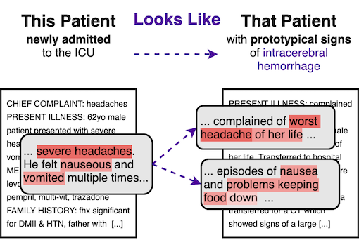

# ProtoPatient



This repository contains source code for the experiments conducted in the paper "_This_ Patient Looks Like _That_ Patient: Prototypical Networks for Interpretable Diagnosis Prediction from Clinical Text".

## Usage

Install requirements: `pip install -r requirements.txt`

For training the ProtoPatient model, which achieved the best results in our experiments, run:
```
python training.py 
            --model_type PROTO
            --train_file {TRAIN.csv}
            --val_file {VAL.csv}
            --test_file {TEST.csv}
            --num_warmup_steps 5000
            --num_training_steps 5000
            --lr_features 0.000005
            --lr_prototypes 0.001
            --lr_others 0.001
            --use_attention True
            --reduce_hidden_size 256
            --all_labels_path {ALL_LABELS.txt}
```

To train the PubMedBERT baseline with the best hyperparameters, use the following command:
```
python training.py 
            --model_type BERT
            --train_file {TRAIN.csv}
            --val_file {VAL.csv}
            --test_file {TEST.csv}
            --num_warmup_steps 1000
            --num_training_steps 5000
            --lr_features 0.00005
            --all_labels_path {ALL_LABELS.txt}
```